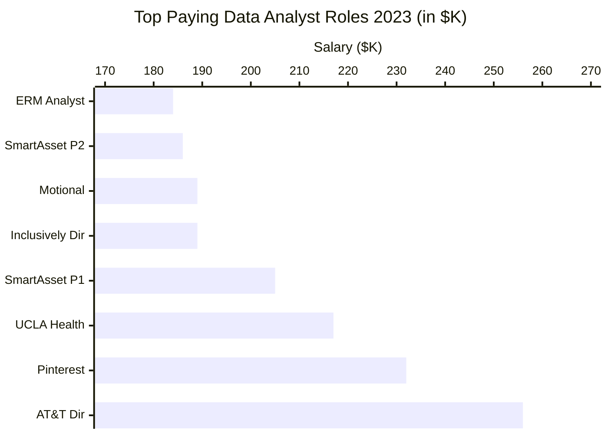
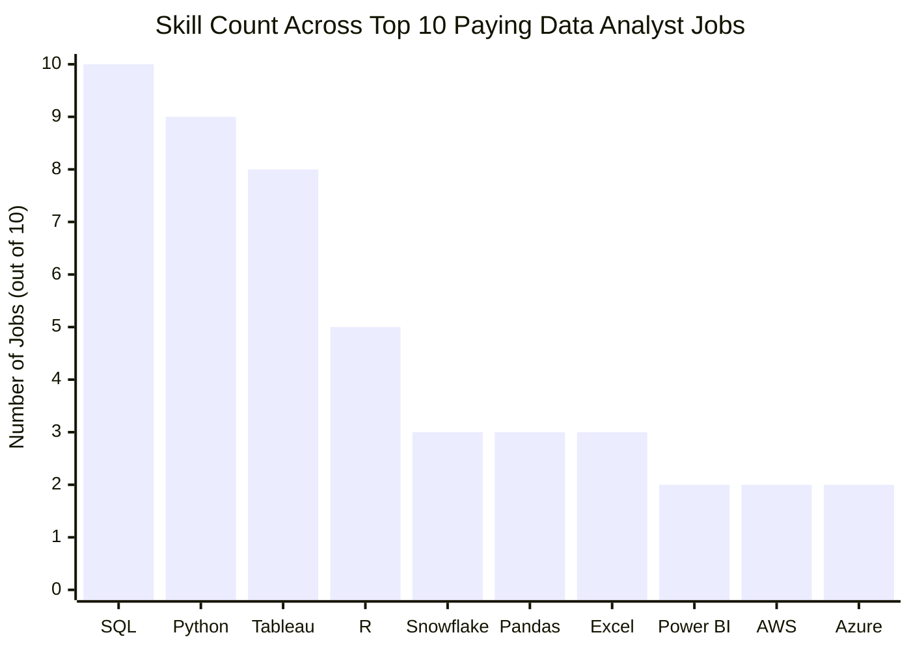
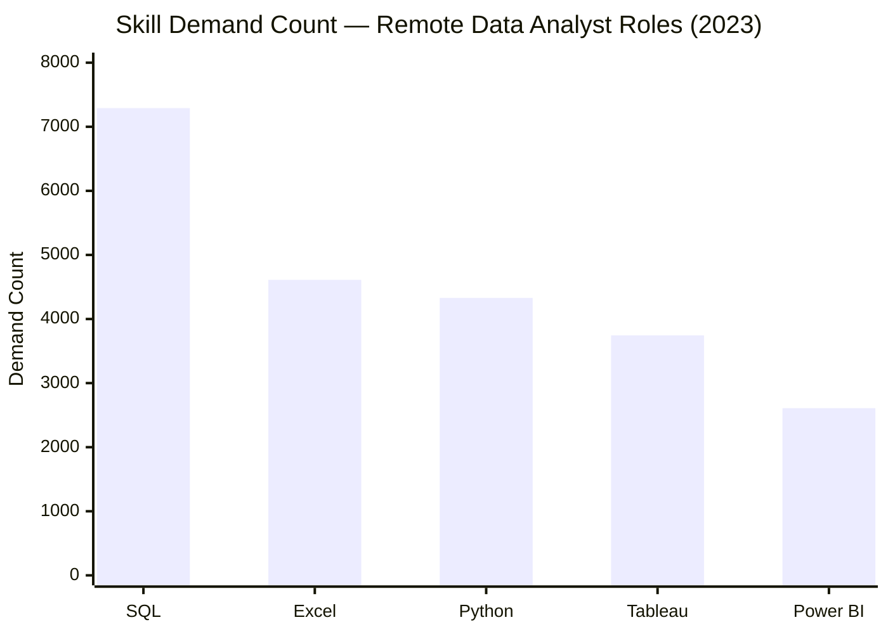
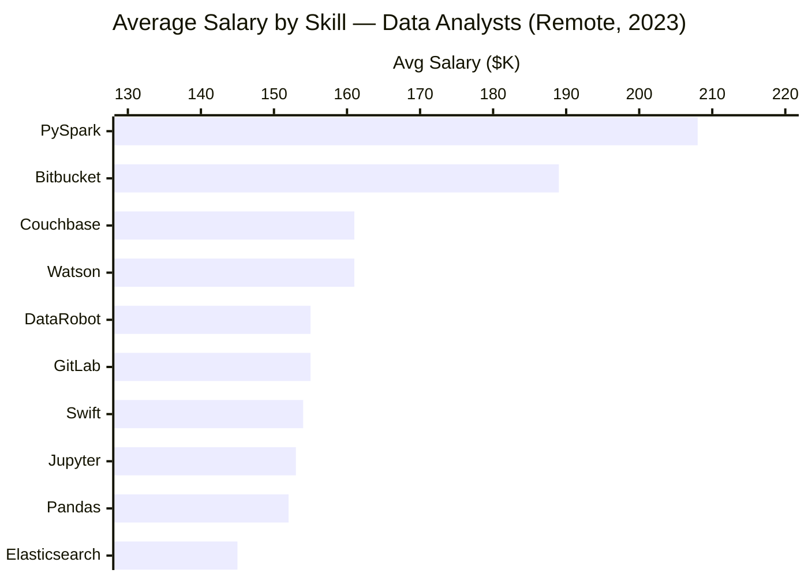
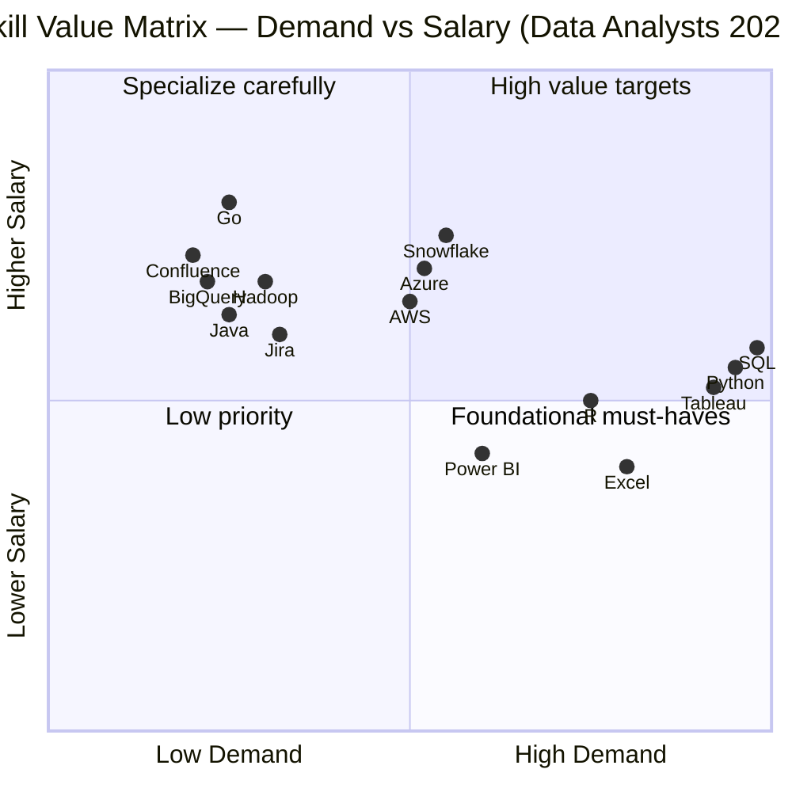

# 📊 Data Analyst Job Market Analysis — 2023

> Exploring top-paying roles, in-demand skills, and optimal skills to learn in the data analyst job market.

---

## 📁 Table of Contents

- [Introduction](#introduction)
- [Background](#background)
- [Tools Used](#tools-used)
- [The Analysis](#the-analysis)
  - [1. Top-Paying Data Analyst Jobs](#1-top-paying-data-analyst-jobs)
  - [2. Skills for Top-Paying Jobs](#2-skills-for-top-paying-jobs)
  - [3. Most In-Demand Skills](#3-most-in-demand-skills)
  - [4. Skills Based on Salary](#4-skills-based-on-salary)
  - [5. Most Optimal Skills to Learn](#5-most-optimal-skills-to-learn)
- [What I Learned](#what-i-learned)
- [Conclusions](#conclusions)

---

## Introduction

This project dives deep into the **data analyst job market** with a focus on:

- 💰 Top-paying roles
- 🔥 Most in-demand skills
- 📈 Where high demand meets high salary

SQL queries used in this project are available in the [`project_sql`](./project_sql/) folder.

---

## Background

This analysis was built to help navigate the data analyst job market more effectively — pinpointing which skills are worth investing time in, and which roles offer the best compensation.

**Data source:** Job postings database from the [SQL Course](https://lukebarousse.com/sql), containing job titles, salaries, locations, and required skills.

**Questions this project answers:**

1. What are the top-paying data analyst jobs?
2. What skills are required for these top-paying jobs?
3. What skills are most in demand for data analysts?
4. Which skills are associated with higher salaries?
5. What are the most optimal skills to learn?

---

## Tools Used

| Tool | Purpose |
|------|---------|
| **SQL** | Core analysis — querying and extracting insights |
| **PostgreSQL** | Database management system for job posting data |
| **Visual Studio Code** | Query execution and database management |
| **Git & GitHub** | Version control and project sharing |

---

## The Analysis

### 1. Top-Paying Data Analyst Jobs

Filtered for remote data analyst roles with non-null average yearly salaries, ordered by salary descending.

```sql
SELECT	
    job_id,
    job_title,
    job_location,
    job_schedule_type,
    salary_year_avg,
    job_posted_date,
    name AS company_name
FROM
    job_postings_fact
LEFT JOIN company_dim ON job_postings_fact.company_id = company_dim.company_id
WHERE
    job_title_short = 'Data Analyst' AND 
    job_location = 'Anywhere' AND 
    salary_year_avg IS NOT NULL
ORDER BY
    salary_year_avg DESC
LIMIT 10;
```

**Top 10 Salaries — Data Analyst Roles (2023)**

```
Role                                          Company            Salary
──────────────────────────────────────────────────────────────────────
Associate Director- Data Insights             AT&T               $255,830
Data Analyst, Marketing                       Pinterest          $232,423
Data Analyst (Hybrid/Remote)                  UCLA Health        $217,000
Principal Data Analyst (Remote)               SmartAsset         $205,000
Director, Data Analyst - HYBRID               Inclusively        $189,309
Principal Data Analyst, AV Performance        Motional           $189,000
Principal Data Analyst                        SmartAsset         $186,000
ERM Data Analyst                              Get It Recruit     $184,000
```

**Salary Distribution — Top 10 Roles**



**Key takeaways:**
- Salary range across top 10 roles: **$184K – $256K** (broader market goes up to $650K)
- Employers span diverse industries: telecom (AT&T), fintech (SmartAsset), healthcare (UCLA), autonomous vehicles (Motional)
- Job titles vary widely — from "Data Analyst" to "Associate Director" — reflecting how seniority and specialization impact pay

---

### 2. Skills for Top-Paying Jobs

Joined job postings with skills data to identify what employers value in high-compensation roles.

```sql
WITH top_paying_jobs AS (
    SELECT	
        job_id,
        job_title,
        salary_year_avg,
        name AS company_name
    FROM
        job_postings_fact
    LEFT JOIN company_dim ON job_postings_fact.company_id = company_dim.company_id
    WHERE
        job_title_short = 'Data Analyst' AND 
        job_location = 'Anywhere' AND 
        salary_year_avg IS NOT NULL
    ORDER BY
        salary_year_avg DESC
    LIMIT 10
)

SELECT 
    top_paying_jobs.*,
    skills
FROM top_paying_jobs
INNER JOIN skills_job_dim ON top_paying_jobs.job_id = skills_job_dim.job_id
INNER JOIN skills_dim ON skills_job_dim.skill_id = skills_dim.skill_id
ORDER BY
    salary_year_avg DESC;
```

**Skill Frequency in Top 10 Paying Jobs**



**Skill breakdown by category:**

| Category | Skills | Notes |
|----------|--------|-------|
| 🔵 Core languages | SQL, Python, R | Appear in 50–100% of top roles |
| 🟢 Visualization | Tableau, Excel, Power BI | Tableau dominates at 8/10 |
| 🟡 Cloud / Infra | AWS, Azure, Snowflake, Oracle | Growing relevance at senior level |
| 🔴 Python libraries | Pandas, NumPy | Common in ML-adjacent roles |
| ⚫ Dev / Collab tools | Jira, Confluence, Atlassian, Bitbucket | Cluster in engineering-adjacent roles |

**Key takeaways:**
- **SQL** appears in all 10 jobs. Non-negotiable.
- **Python** follows at 9/10. Effectively a baseline requirement.
- **Tableau** at 8/10 — still the leading visualization tool at this salary tier.
- **More skills ≠ higher salary.** Pinterest ($232K) required only 5 skills. Inclusively's Director role ($189K) required 14.

---

### 3. Most In-Demand Skills

Identified skills most frequently requested across all remote data analyst job postings.

```sql
SELECT 
    skills,
    COUNT(skills_job_dim.job_id) AS demand_count
FROM job_postings_fact
INNER JOIN skills_job_dim ON job_postings_fact.job_id = skills_job_dim.job_id
INNER JOIN skills_dim ON skills_job_dim.skill_id = skills_dim.skill_id
WHERE
    job_title_short = 'Data Analyst' 
    AND job_work_from_home = True 
GROUP BY
    skills
ORDER BY
    demand_count DESC
LIMIT 5;
```

**Top 5 Most In-Demand Skills**



| Skill | Demand Count |
|-------|-------------|
| SQL | 7,291 |
| Excel | 4,611 |
| Python | 4,330 |
| Tableau | 3,745 |
| Power BI | 2,609 |

**Key takeaways:**
- SQL leads demand by a wide margin — **68% more postings** than the next skill
- Excel remains essential, indicating that foundational spreadsheet skills are still expected despite advanced tooling
- Python and Tableau are neck-and-neck, both pointing to growing demand for programming and data storytelling

---

### 4. Skills Based on Salary

Explored which skills are associated with the highest average salaries for remote data analyst roles.

```sql
SELECT 
    skills,
    ROUND(AVG(salary_year_avg), 0) AS avg_salary
FROM job_postings_fact
INNER JOIN skills_job_dim ON job_postings_fact.job_id = skills_job_dim.job_id
INNER JOIN skills_dim ON skills_job_dim.skill_id = skills_dim.skill_id
WHERE
    job_title_short = 'Data Analyst'
    AND salary_year_avg IS NOT NULL
    AND job_work_from_home = True 
GROUP BY
    skills
ORDER BY
    avg_salary DESC
LIMIT 25;
```

**Top 10 Highest-Paying Skills**



| Skill | Avg Salary ($) |
|-------|--------------|
| PySpark | $208,172 |
| Bitbucket | $189,155 |
| Couchbase | $160,515 |
| Watson | $160,515 |
| DataRobot | $155,486 |
| GitLab | $154,500 |
| Swift | $153,750 |
| Jupyter | $152,777 |
| Pandas | $151,821 |
| Elasticsearch | $145,000 |

**Key takeaways:**
- **Big data & ML tools** (PySpark, DataRobot, Jupyter) command top salaries — the market pays a premium for data engineering crossover
- **DevOps/deployment skills** (GitLab, Bitbucket) indicate that analysts who can operate in engineering workflows earn significantly more
- **Cloud skills** (Elasticsearch, Databricks, GCP) confirm that cloud proficiency boosts earning potential

---

### 5. Most Optimal Skills to Learn

Combined demand and salary data to identify skills that are both widely requested and well-compensated — the best ROI for skill development.

```sql
SELECT 
    skills_dim.skill_id,
    skills_dim.skills,
    COUNT(skills_job_dim.job_id) AS demand_count,
    ROUND(AVG(job_postings_fact.salary_year_avg), 0) AS avg_salary
FROM job_postings_fact
INNER JOIN skills_job_dim ON job_postings_fact.job_id = skills_job_dim.job_id
INNER JOIN skills_dim ON skills_job_dim.skill_id = skills_dim.skill_id
WHERE
    job_title_short = 'Data Analyst'
    AND salary_year_avg IS NOT NULL
    AND job_work_from_home = True 
GROUP BY
    skills_dim.skill_id
HAVING
    COUNT(skills_job_dim.job_id) > 10
ORDER BY
    avg_salary DESC,
    demand_count DESC
LIMIT 25;
```

**Optimal Skills — Demand vs Salary**



**Top Optimal Skills Ranked by Salary**

| Skill | Demand Count | Avg Salary ($) |
|-------|-------------|--------------|
| Go | 27 | $115,320 |
| Confluence | 11 | $114,210 |
| Hadoop | 22 | $113,193 |
| Snowflake | 37 | $112,948 |
| Azure | 34 | $111,225 |
| BigQuery | 13 | $109,654 |
| AWS | 32 | $108,317 |
| Java | 17 | $106,906 |
| SSIS | 12 | $106,683 |
| Jira | 20 | $104,918 |

**Key takeaways:**

- **Cloud tools are the sweet spot:** Snowflake (37 postings, $113K), Azure (34, $111K), and AWS (32, $108K) offer a strong combination of demand and salary
- **Python and R are high-demand but not the highest-paid** — demand counts of 236 and 148 respectively, with avg salaries around $101K. They're expected, not differentiating.
- **Tableau and Looker** (demand: 230 and 49) sit around $99K–$104K — critical for business intelligence roles
- **Database technologies** (Oracle, SQL Server, NoSQL) remain relevant at $98K–$104K

---

## What I Learned

Throughout this project, key SQL skills were developed and applied:

- 🧩 **Complex query crafting** — multi-table JOINs, CTEs (`WITH` clauses), and subqueries
- 📊 **Data aggregation** — `GROUP BY`, `COUNT()`, `AVG()`, and `HAVING` filters
- 💡 **Analytical thinking** — translating business questions into structured SQL logic

---

## Conclusions

### Key Insights

| # | Insight |
|---|---------|
| 1 | **Top-paying roles:** Remote data analyst salaries range from $184K to $650K at the top end |
| 2 | **Skills for top pay:** SQL is the most critical skill for high-compensation roles |
| 3 | **Most in-demand:** SQL leads all skills in raw job posting volume by a large margin |
| 4 | **Highest-paying skills:** Niche tools like PySpark and DevOps skills (GitLab, Bitbucket) command a salary premium |
| 5 | **Optimal skills:** Cloud platforms (Snowflake, Azure, AWS) offer the best balance of demand and salary |

### Closing Thoughts

The data is clear: **SQL is non-negotiable**, Python and Tableau are baseline expectations at the top of the market, and cloud skills are the most strategic next investment. Chasing every skill on this list is not the answer — the data does not reward breadth. Focus on the high-demand, high-salary intersection and build from there.

---

*Data sourced from 2023 job postings. Analysis conducted using PostgreSQL and SQL.*  
*Project by [Luke Barousse](https://lukebarousse.com) | SQL queries in [`/project_sql`](./Project_sql/)*
